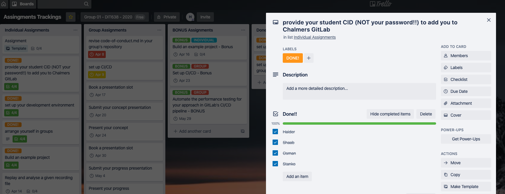
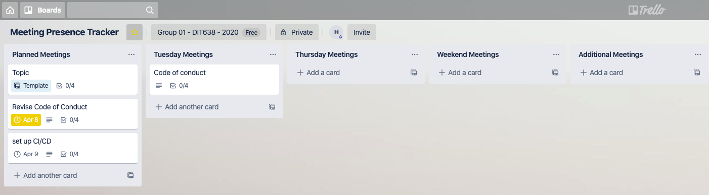
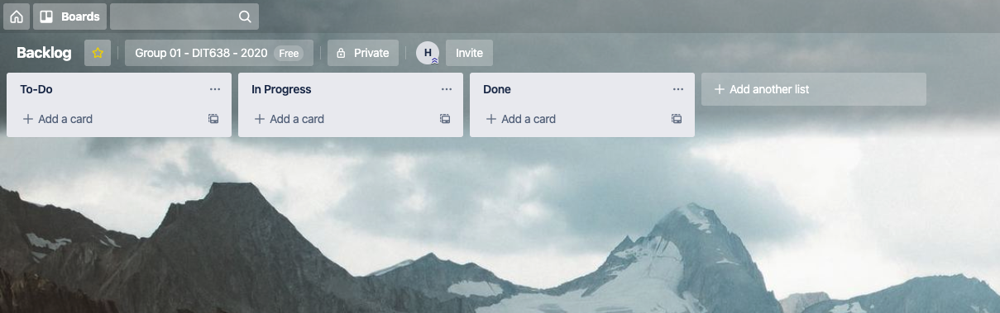

## **Communication Tools**
*   Trello
*   Whatsapp Messaging
*   Zoom Group meetings

## **Collaboration Strategy**

*   The main tools used to enhance the communication, collaboration and palnning between the Team Members working from distance on this project will be those mentioned above.
*   The project workload is divided into 3 main categories.  **_Individual Assignments_**, **_Group Assignments_** and **_Bonus Assignements_** which will be reflected on the trello board for Assignments Trackings.
*   Each member will be responsible for his progress for Individual Assignments and will have to check **_DONE!_** when done with a certain assignment.
    
*   Group Assignments will be done togather during the Zoom Group Meetings.
*   Trello will also be used to keep track of All the group meetings and presence of the team members during these meetings.
*   There will be **_Three meetings_** every week beside the additional meetings and presence for each team member will be registered per meeting.
    
*   Whatsapp group will be the primary tool used for **daily communication** and this will be used for planning additional zoom meetings or for helping eachother with the individual assignments etc

*   The **Topics** of the meetings will be mostly focused around the Group Assignments. The main idea is to discuss and understand the assignments so that we can break them down in smaller tasks which can be conducted in pairs or individually if possible in a more efficient and focused environment.

## **Awareness of Individual Contribution**
*   In the beginning of each meeting, during first 10 minutes each team member will update their progress in the Backlog and inform other team members about his/her work, so that everybody is up to date. In this way, if any task by any team member is not accomplished or completed.
    

## **Knowledge Distribution among Team Members**

*  The responsibilities of each team member will be changed and swapped weekly throughout the project so that everybody in the group will have contribuited to each part of the project and gained an over all experience.

## **Usual Communication Plan**

*  The Group meetings are planned to be held three times per week after every Tuesday and Wednesday lecture and on Saturdays using Zoom or Skype. Daily communication between team members will take place instead on whatsapp if needed.

## **Conflict Resolving Strategy**

*   Any dispute or disagreement between the team members will be considered as a **Conflict**.
*   Each **Conflict** will be discussed first internally by scheduling a meeting where the presence of the team members will be mandatory.
*   During this meeting, possible **Solutions** to the problem will be proposed.
*   A **Solution** will be chosen by applying the democratic voting strategy.
*   If the **conflict** persists, it will be taken up to be discussed with the Course Coorniator.
